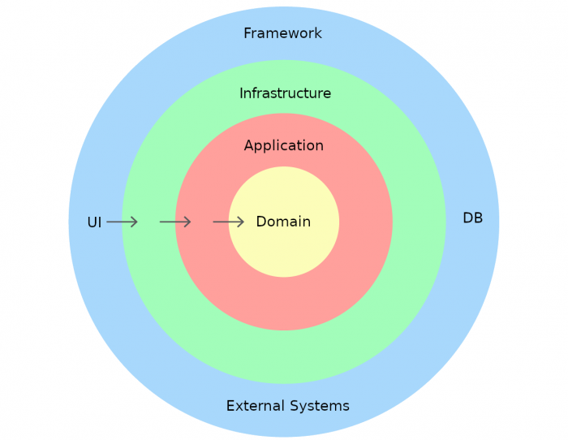

# Dehn Backend Task Manager

Backend coding task for Dehn. This consist of a simple **task manager** that allows you to perform simple
CRUD operations (create, read, update and delete) on tasks.

## Design decisions

### Language and framework

I chose **Java 17** and **SpringBoot** as those are the language and framework mainly required for this position.
In addition, Spring provides a simple way to 

- generate shell commands using the `@ShellComponent` annotation
- autowire services
- basically test everything

### Architecture and programming paradigm

 

For the architecture, **TDD** (Test Driven Development) and **DDD** (Domain Driven Design) were used.
This combination is highly effective to have **functional**, **clean** and **tested** code in production from the start.
DDD, in addition, allows to **change the infrastructure layer** so that, for example, the entrypoint in the future 
could be REST controllers for an API instead of shell commands.
Finally, I worked with **git, GitHub and branches** for each little feature and merged them to the main branch 
when they were working.

#### Application layer

Here there are the **use cases** (application services) that receive the parameters from the infrastructure layer 
and call the repositories. They also are in charge of **instantiating** the domain objects, returning the 
results and calling other necessary components.

#### Domain layer

- **Entities** that represent and encapsulate the data of business concepts. 
  - Here we only have the Task entity.
- **Value objects**: smaller objects that contain some business logic, but are not entities. 
  - Here we Just have the TaskStatus enum.
- **Interfaces** that define the contracts that the infrastructure layer must implement.
- Domain **exceptions** that represent failures related to the business logic.

#### Infrastructure layer

- **Commands**: shell commands that receive the parameters from the user and call the application layer
  - They also format the output to the user
- **Infrastructure implementations**: classes that implement the interfaces defined in the domain layer
   - Here we only have the repositories, but we could have event buses, mail senders, etc.

#### Coding process

The process of implementing the task has been more or less as follows:

1. Create a **branch** for the feature with `git checkout -b feat/feature-name`
2. Start from the **outside** (shell commands) with a fake implementation. This is called an *outside-in* approach
   1. **Test** the shell commands with the fake implementation and make sure they are working
   2. **Merge** the branch to the main branch
3. Implement the **application layer** (use cases) moving the fake implementation there
   1. Adapt and **test** everything
   2. **Merge** the branch to the main branch
4. Implement the **repositories** with the **real implementation**
    1. Adapt and **test** everything
    2. **Merge** the branch to the main branch

Some notes:

- Sometimes in step 3 I also sketch the repository methods because they were obvious
- Some **refactors** are made throughout the process
- Of course, I did not follow this pattern to the letter, but it was the general idea


### Database

It was required to use a **file-based** database. I chose a **json** file as it is simple to use and parse.
I could have used libraries that work with json files, but I decided to implement it myself to control 
the auto incremental ID and also to eliminate the need for a library.

## Requirements

- [Java 17](https://www.oracle.com/java/technologies/javase/jdk17-archive-downloads.html). 
  - Also setting the **JAVA_HOME** environment variable correctly
- [Maven](https://maven.apache.org/download.cgi)
- [Make](https://www.gnu.org/software/make/): optional but recommended. For Windows users it might be harder to set up.


## Installation

Note: I developed this project on a Unix system, and on Windows only the `mvn` alternative worked, `mvnw.cmd` did not.
To generate the jar file, run the following command:

```bash
# Unix alternatives
make clean-package
./mvnw clean package -DskipTests

# Windows alternatives
mvn clean package -DskipTests
./mvnw.cmd clean package -DskipTests
```

This will generate the [executable jar file](target/dehn-backend-task-manager-0.0.1-SNAPSHOT.jar) in the `target` directory.

## How to run

### Create a task

To create a task, run the following command:

```bash
java -jar target/dehn-backend-task-manager-0.0.1-SNAPSHOT.jar create-task task_title task_description task_due_date task_status
# Unix alternative
make run-create-task args="task_title task_description task_due_date task_status"
```

**Output**: the task created with the inserted ID.

Notes: 

- the available status are `PENDING` and `COMPLETED`.
- if not present, the status will be `PENDING`.

### List all tasks

To list all tasks, run the following command:

```bash
java -jar target/dehn-backend-task-manager-0.0.1-SNAPSHOT.jar list-tasks
# Unix alternative
make run-list-tasks
```

This will output all the tasks in the database with the fields tab separated.

### Update a task

To update a task, run the following command:

```bash
java -jar target/dehn-backend-task-manager-0.0.1-SNAPSHOT.jar update-task task_id task_title task_description task_due_date task_status
# Unix alternative
make run-update-task args="task_id task_title task_description task_due_date task_status"
```

**Output**: success message.

Note: again, the available status are `PENDING` and `COMPLETED`.

### Delete a task

To delete a task, run the following command:

```bash
java -jar target/dehn-backend-task-manager-0.0.1-SNAPSHOT.jar delete-task task_id
# Unix alternative
make run-delete-task args="task_id"
```

**Output**: success message.

## Example successful run

Unix


```bash
make run-create-task args="Task1 Description1 2022-12-31 PENDING"
make run-create-task args="Task2 Description2 2022-12-31 PENDING"
make run-list-tasks
make run-update-task args="1 Task1 Description1 2022-12-31 COMPLETED"
make run-list-tasks
make run-delete-task args="2"
make run-list-tasks
```

Windows / long command version

```bash
java -jar target/dehn-backend-task-manager-0.0.1-SNAPSHOT.jar create-task Task1 Description1 2022-12-31 PENDING
java -jar target/dehn-backend-task-manager-0.0.1-SNAPSHOT.jar create-task Task2 Description2 2022-12-31 PENDING
java -jar target/dehn-backend-task-manager-0.0.1-SNAPSHOT.jar list-tasks
java -jar target/dehn-backend-task-manager-0.0.1-SNAPSHOT.jar update-task 1 Task1 Description1 2022-12-31 COMPLETED
java -jar target/dehn-backend-task-manager-0.0.1-SNAPSHOT.jar list-tasks
java -jar target/dehn-backend-task-manager-0.0.1-SNAPSHOT.jar delete-task 2
java -jar target/dehn-backend-task-manager-0.0.1-SNAPSHOT.jar list-tasks
```

## Database

The database is a json file located [here](src/main/resources/db/task-manager.json).

For parsing, I used the [simple-json library](https://code.google.com/archive/p/json-simple/)

Implementation can be found [here](src/main/java/com/mhb/dehn_backend_task_manager/Infrastructure/Persistence/Json/JsonTaskRepository.java)

## Testing

To run the tests, run the following command:

```bash
# Unix alternatives
./mvnw test
make test

# Windows alternatives
mvn test
./mvnw.cmd test
```

## Improvements

I did what was required, but there are some improvements that could be made:

- More value objects for the task fields to ensure the data is correct. Examples
  - use date type for due date
  - ensure title and/or description are not empty
- Use the [shell test framework](https://docs.spring.io/spring-shell/reference/testing/basics.html) to test the command
- Dockerize the application
  - I have a branch for this, but I did not have time to finish it as the mapping with the database file was not working
- This was not required, but adding an event bus implementation would be nice to have for when a task has been created, deleted or updated

## Author

Marco Hurtado Bandrés:

- LinkedIn: [marco-hurtado-bandres](https://www.linkedin.com/in/marco-hurtado-bandres/)
- GitHub: [marcohb99](https://github.com/marcohb99)